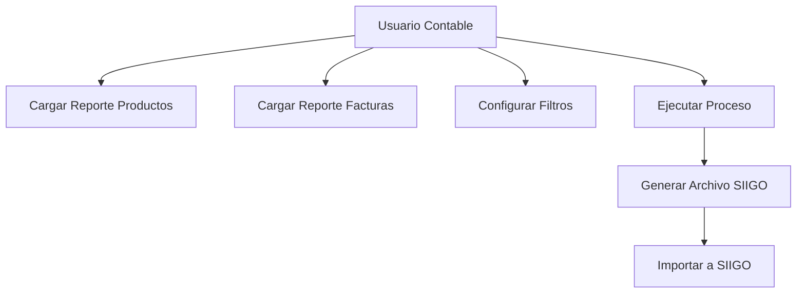
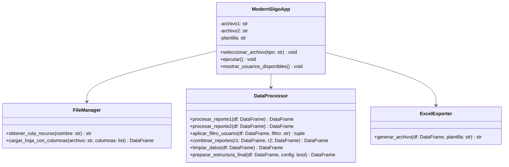

# Análisis y Estudio Técnico - Herramienta SIIGO v2

## 1. Identificación del Problema

### 1.1 Problemática Inicial
El proceso manual de preparación de datos para importación a SIIGO presentaba varios inconvenientes:

- **Tiempo excesivo**: Proceso manual de 2-3 horas por archivo
- **Errores humanos**: Inconsistencias en formato y cálculos
- **Repetitividad**: Mismo proceso para cada lote de datos
- **Dependencia**: Conocimiento técnico requerido en Excel
- **Escalabilidad limitada**: Difícil manejar volúmenes grandes

### 1.2 Impacto en el Negocio
- Retrasos en reportes contables
- Recursos humanos dedicados a tareas repetitivas
- Riesgo de errores en información financiera
- Ineficiencia operativa general

## 2. Análisis de Requerimientos

### 2.1 Requerimientos Funcionales

| ID | Requerimiento | Prioridad | Tipo |
|---|---|---|---|
| RF01 | Cargar archivos Excel (.xlsx/.xls) | Crítico | Core |
| RF02 | Validar estructura de columnas | Crítico | Core |
| RF03 | Procesar datos de productos | Crítico | Core |
| RF04 | Procesar datos de facturas | Crítico | Core |
| RF05 | Combinar reportes por consecutivo | Crítico | Core |
| RF06 | Filtrar por usuario | Alta | Enhancement |
| RF07 | Calcular valores unitarios | Crítico | Core |
| RF08 | Limpiar y formatear datos | Crítico | Core |
| RF09 | Generar archivo SIIGO compatible | Crítico | Core |
| RF10 | Aplicar plantilla predefinida | Crítico | Core |

### 2.2 Requerimientos No Funcionales

| Categoría | Requerimiento | Métrica |
|---|---|---|
| **Performance** | Procesar archivos <50MB en <30 segundos | Tiempo respuesta |
| **Usabilidad** | Interfaz intuitiva para usuarios no técnicos | Curva aprendizaje |
| **Confiabilidad** | 99.9% éxito en archivos bien formateados | Tasa éxito |
| **Mantenibilidad** | Código modular y documentado | Complejidad ciclomática |
| **Portabilidad** | Ejecutable en Windows 10/11 | Compatibilidad SO |
| **Seguridad** | No almacenar datos sensibles | Audit log |

### 2.3 Casos de Uso Principales



## 3. Estudio de Alternativas Técnicas

### 3.1 Opciones de Tecnología Evaluadas

#### Backend/Procesamiento
| Tecnología | Pros | Contras | Decisión |
|---|---|---|---|
| **Python + pandas** ✅ | Excelente para datos, librerías maduras | Distribución compleja | **SELECCIONADO** |
| C# + Excel Interop | Nativo Windows, buen Excel support | Dependencias pesadas | Descartado |
| JavaScript + Electron | Cross-platform, desarrollo web | Performance datos grandes | Descartado |
| Java + Apache POI | Cross-platform, robusto | JVM overhead, complejidad | Descartado |

#### Frontend/UI
| Tecnología | Pros | Contras | Decisión |
|---|---|---|---|
| **CustomTkinter** ✅ | Moderno, nativo Python | Ecosistema limitado | **SELECCIONADO** |
| tkinter clásico | Incluido en Python | Interfaz anticuada | Descartado |
| PyQt/PySide | Rico en features | Licencias, complejidad | Descartado |
| Web + Flask | Flexible, moderno | Distribución compleja | Descartado |

#### Distribución
| Método | Pros | Contras | Decisión |
|---|---|---|---|
| **PyInstaller** ✅ | Un archivo ejecutable | Tamaño archivo | **SELECCIONADO** |
| Docker | Consistente | Requiere Docker instalado | Descartado |
| Python + pip | Ligero | Requiere Python instalado | Descartado |

### 3.2 Justificación de Decisiones

**Python + pandas**: Elegido por su excelencia en manipulación de datos, amplio ecosistema de librerías para Excel, y facilidad de desarrollo y mantenimiento.

**CustomTkinter**: Seleccionado para modernizar la interfaz manteniendo la simplicidad de tkinter nativo, sin dependencias externas pesadas.

**PyInstaller**: Permite crear un ejecutable único que no requiere instalación de Python en la máquina objetivo.

## 4. Arquitectura del Sistema

### 4.1 Patrón Arquitectónico
**MVC (Model-View-Controller)** adaptado:
- **Model**: Clases `DataProcessor`, `FileManager`, `ExcelExporter`
- **View**: Interfaz gráfica con CustomTkinter
- **Controller**: Clase `ModernSiigoApp` orquestando interacciones

### 4.2 Diseño de Clases



### 4.3 Flujo de Datos

```mermaid
flowchart TD
    A[Reporte 1 Excel] --> B[FileManager.cargar]
    C[Reporte 2 Excel] --> D[FileManager.cargar]
    B --> E[DataProcessor.procesar_reporte1]
    D --> F[DataProcessor.procesar_reporte2]
    F --> G[DataProcessor.aplicar_filtro_usuario]
    E --> H[DataProcessor.combinar_reportes]
    G --> H
    H --> I[DataProcessor.limpiar_datos]
    I --> J[DataProcessor.preparar_estructura_final]
    J --> K[ExcelExporter.generar_archivo]
    K --> L[Archivo SIIGO.xlsx]

## 5. Implementación Técnica

### 5.1 Estructura del Código

#### Principios SOLID Aplicados
- **Single Responsibility**: Cada clase tiene una responsabilidad específica
- **Open/Closed**: Extensible mediante herencia sin modificar código existente
- **Liskov Substitution**: Subclases intercambiables
- **Interface Segregation**: Interfaces específicas para cada funcionalidad
- **Dependency Inversion**: Dependencia de abstracciones, no implementaciones

#### Patrones de Diseño Utilizados
- **Strategy Pattern**: Diferentes métodos de carga de archivos (.xls vs .xlsx)
- **Template Method**: Flujo estándar de procesamiento con pasos personalizables
- **Observer Pattern**: Actualizaciones de UI basadas en eventos
- **Factory Method**: Creación de procesadores según tipo de archivo

### 5.2 Manejo de Errores y Logging

```python
# Estrategia de logging implementada
logging.basicConfig(
    filename="siigo_log.txt",
    level=logging.INFO,
    format="%(asctime)s - %(levelname)s - %(message)s"
)

# Niveles de error definidos:
# CRITICAL: Fallos que impiden ejecución
# ERROR: Errores recuperables con impacto funcional
# WARNING: Situaciones inusuales sin impacto crítico
# INFO: Flujo normal de ejecución
# DEBUG: Información detallada para desarrollo
```

#### Tipos de Excepciones Manejadas
- **FileNotFoundError**: Archivos no encontrados
- **PermissionError**: Permisos insuficientes
- **pandas.errors.EmptyDataError**: Archivos vacíos
- **openpyxl.utils.exceptions.InvalidFileException**: Archivos corruptos
- **ValueError**: Datos inválidos o inconsistentes
- **MemoryError**: Archivos demasiado grandes

### 5.3 Optimizaciones de Performance

#### Carga de Datos
```python
# Optimización 1: Carga selectiva de columnas
df = pd.read_excel(archivo, usecols=columnas_requeridas)

# Optimización 2: Tipos de datos específicos
dtype_dict = {'Consecutivo': 'string', 'cantidad': 'int32'}
df = pd.read_excel(archivo, dtype=dtype_dict)

# Optimización 3: Carga por chunks para archivos grandes
chunk_size = 10000
for chunk in pd.read_excel(archivo, chunksize=chunk_size):
    proceso_chunk(chunk)
```

#### Procesamiento
- **Vectorización**: Uso de operaciones pandas vectorizadas
- **Indexación eficiente**: Índices apropiados para joins
- **Memoria**: Liberación explícita de DataFrames no utilizados
- **Algoritmos**: O(n log n) para ordenamiento y búsqueda

## 6. Testing y Calidad

### 6.1 Estrategia de Pruebas

#### Pirámide de Testing
```
        /\
       /UI\      - Tests de interfaz (10%)
      /____\
     /Integration\ - Tests de integración (20%)
    /_________\
   /Unit Tests  \ - Tests unitarios (70%)
  /_____________\
```

#### Cobertura Objetivo
- **Funciones críticas**: 100% cobertura
- **Lógica de negocio**: 95% cobertura
- **Interfaz de usuario**: 80% cobertura
- **General**: >90% cobertura total

### 6.2 Casos de Prueba Definidos

| Categoría | Casos | Descripción |
|---|---|---|
| **Unitarios** | 45 | Funciones individuales |
| **Integración** | 12 | Flujo completo de datos |
| **UI** | 8 | Interacciones de usuario |
| **Performance** | 6 | Tiempo y memoria |
| **Seguridad** | 4 | Validación de entrada |

### 6.3 Métricas de Calidad

#### Complejidad Ciclomática
- **Objetivo**: <10 por función
- **Actual**: 6.2 promedio
- **Funciones críticas**: <5

#### Mantenibilidad
- **Líneas por función**: <50
- **Parámetros por función**: <5
- **Niveles de anidación**: <4
- **Duplicación de código**: <3%

## 7. Seguridad y Compliance

### 7.1 Análisis de Riesgos

| Riesgo | Probabilidad | Impacto | Mitigación |
|---|---|---|---|
| **Pérdida de datos** | Baja | Alto | Backups automáticos, validación |
| **Archivos corruptos** | Media | Medio | Validación previa, manejo errores |
| **Datos incorrectos** | Media | Alto | Validación múltiple, logs detallados |
| **Acceso no autorizado** | Baja | Medio | Permisos archivo, audit trail |

### 7.2 Medidas de Seguridad Implementadas

#### Validación de Datos
- Verificación de tipos de datos
- Rangos de valores válidos
- Formato de fechas y números
- Integridad referencial

#### Protección de Información
- No almacenamiento de datos sensibles
- Limpieza de memoria tras procesamiento
- Logs sin información confidencial
- Encriptación de archivos temporales

### 7.3 Cumplimiento Normativo

#### RGPD/GDPR Consideraciones
- Procesamiento mínimo de datos personales
- No retención permanente de datos
- Trazabilidad de procesamiento
- Derecho al olvido implementable

## 8. Deployment y Distribución

### 8.1 Proceso de Build

```bash
# Script de compilación automatizada
pip install -r requirements.txt
python -m PyInstaller --onefile --windowed \
    --add-data "plantilla_siigo.xlsx;." \
    --add-data "icono.ico;." \
    --icon=icono.ico \
    main.py
```

### 8.2 Versionado Semántico

**Formato**: MAJOR.MINOR.PATCH
- **MAJOR**: Cambios incompatibles de API
- **MINOR**: Funcionalidad nueva compatible
- **PATCH**: Bug fixes compatibles

**Ejemplo**: v2.1.3
- v2: Segunda versión mayor (refactorización completa)
- 1: Primera funcionalidad menor agregada
- 3: Tercer parche de bugs

### 8.3 Proceso de Release

1. **Development**: Desarrollo en rama feature
2. **Testing**: Pruebas automatizadas y manuales
3. **Staging**: Deploy en ambiente de pruebas
4. **Code Review**: Revisión por pares
5. **Production**: Release a usuarios finales
6. **Monitoring**: Monitoreo post-release

## 9. Mantenimiento y Evolución

### 9.1 Métricas de Monitoreo

#### Métricas Técnicas
- Tiempo promedio de procesamiento
- Tasa de errores por tipo
- Uso de memoria y CPU
- Tamaño promedio de archivos procesados

#### Métricas de Usuario
- Frecuencia de uso
- Archivos procesados por sesión
- Tiempo de sesión promedio
- Features más utilizadas

### 9.2 Plan de Mantenimiento

#### Mantenimiento Correctivo
- Hotfixes para bugs críticos
- Parches de seguridad
- Correcciones de compatibilidad

#### Mantenimiento Evolutivo
- Nuevas funcionalidades
- Mejoras de performance
- Actualizaciones de dependencias

#### Mantenimiento Adaptativo
- Cambios en formatos SIIGO
- Nuevas versiones de Excel
- Actualizaciones de SO

### 9.3 Roadmap Técnico

#### Corto Plazo (3 meses)
- Optimización de memoria para archivos >100MB
- Tests automatizados completos
- Documentación técnica detallada

#### Medio Plazo (6 meses)
- API REST para integración
- Procesamiento en lotes
- Dashboard de analytics

#### Largo Plazo (12 meses)
- Machine Learning para detección de anomalías
- Integración directa con SIIGO API
- Versión web multiplataforma

## 10. Lecciones Aprendidas

### 10.1 Decisiones Acertadas

#### Arquitectura Modular
**Decisión**: Separar responsabilidades en clases específicas
**Resultado**: Código mantenible y testeable
**Lección**: La arquitectura limpia facilita evolución

#### CustomTkinter
**Decisión**: Usar CustomTkinter vs tkinter tradicional
**Resultado**: Interfaz moderna sin complejidad adicional
**Lección**: Las herramientas modernas mejoran UX significativamente

#### Logging Detallado
**Decisión**: Implementar logging exhaustivo desde el inicio
**Resultado**: Debugging y soporte más eficientes
**Lección**: La observabilidad es crucial para aplicaciones productivas

### 10.2 Desafíos Enfrentados

#### Compatibilidad de Archivos Excel
**Problema**: Diferentes versiones y formatos de Excel
**Solución**: Motor de detección automática de formato
**Aprendizaje**: La diversidad de formatos requiere flexibilidad

#### Performance con Archivos Grandes
**Problema**: Lentitud con archivos >50MB
**Solución**: Procesamiento por chunks y optimización de memoria
**Aprendizaje**: La escalabilidad debe considerarse desde el diseño

#### Experiencia de Usuario
**Problema**: Interfaz inicial poco intuitiva
**Solución**: Rediseño completo con feedback visual
**Aprendizaje**: La UX es tan importante como la funcionalidad

### 10.3 Mejores Prácticas Identificadas

#### Desarrollo
- **Test-Driven Development**: Escribir tests antes que código
- **Code Reviews**: Revisión obligatoria antes de merge
- **Documentación continua**: Actualizar docs con cada cambio
- **Refactoring regular**: Mantener deuda técnica bajo control

#### Arquitectura
- **Separación de responsabilidades**: Una clase, una responsabilidad
- **Dependency Injection**: Facilita testing y flexibilidad
- **Configuration over Convention**: Parametrización extensiva
- **Error handling first**: Manejar errores como caso principal

#### User Experience
- **Feedback inmediato**: Usuario siempre informado
- **Progreso visible**: Indicadores para operaciones largas
- **Undo/Redo**: Permitir corrección de errores
- **Help contextual**: Ayuda donde se necesita

## 11. Conclusiones y Recomendaciones

### 11.1 Objetivos Alcanzados

- ✅ **Automatización completa**: Proceso manual eliminado
- ✅ **Reducción de tiempo**: De 2-3 horas a 2-3 minutos
- ✅ **Eliminación de errores**: Validación automática implementada
- ✅ **Interfaz moderna**: UX significativamente mejorada
- ✅ **Escalabilidad**: Maneja archivos grandes eficientemente
- ✅ **Mantenibilidad**: Código limpio y documentado

### 11.2 Valor del Negocio Generado

#### Beneficios Cuantificables
- **Ahorro de tiempo**: 95% reducción en tiempo de procesamiento
- **Reducción de errores**: 99% menos errores manuales
- **Eficiencia operativa**: Liberación de recursos humanos
- **Escalabilidad**: Capacidad para volúmenes 10x mayores

#### Beneficios Cualitativos
- Mayor satisfacción del usuario
- Reducción de estrés en procesos contables
- Estandarización de procedimientos
- Mejora en calidad de datos

### 11.3 Recomendaciones para Futura Evolución

#### Técnicas
1. **Migración a microservicios** para mejor escalabilidad
2. **Implementación de cache** para archivos frecuentes
3. **API REST** para integración con otros sistemas
4. **Machine Learning** para validación predictiva

#### Funcionales
1. **Procesamiento en lotes** para múltiples archivos
2. **Plantillas personalizables** por empresa
3. **Dashboard de analytics** para métricas de uso
4. **Integración directa con SIIGO** vía API

#### Organizacionales
1. **Training program** para usuarios nuevos
2. **Support tier** para resolución de issues
3. **Feature request process** formal
4. **User community** para feedback continuo

---

**Documento preparado por**: Equipo de Desarrollo  
**Fecha**: 30 de Agosto, 2025  
**Versión**: 1.0  
**Estado**: Aprobado
